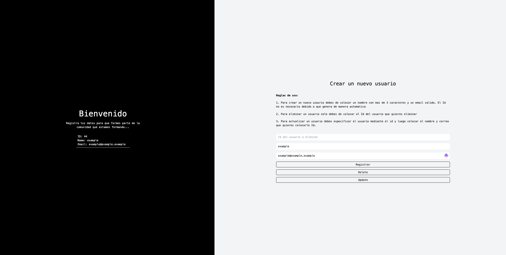

This project is a simple example of how to create a basic CRUD (Create, Read, Update, Delete) application using Next.js, Drizzle, PlanetScale, and TailwindCSS.

## Technologies Used

- **Next.js**: A React framework for building fast and scalable web applications.
- **Drizzle**: A JavaScript ORM that simplifies working with relational databases.
- **PlanetScale**: A MySQL-compatible database that runs in the cloud.
- **TailwindCSS**: A CSS framework that allows you to create custom designs without writing CSS from scratch.

## Project Description

The web application allows users to create, read, update, and delete user records.

## How to Run the Project

To run the project, you first need to install the necessary dependencies. You can do this by running the following command:

```bash
npm install
```

Once the dependencies are installed, you can start the development server by running the following command:

```bash
npm run dev


The development server will start on port 3000. You can access the web application at the following URL:

http://localhost:3000


Image

Screenshot




The image displays the main page of the web application. This page allows users to create new user records.

To create a new record, users must enter their name and email. Once the user submits the form, their data is stored in the PlanetScale database using the Drizzle ORM.

The web application also allows users to read, update, and delete user records.

```
